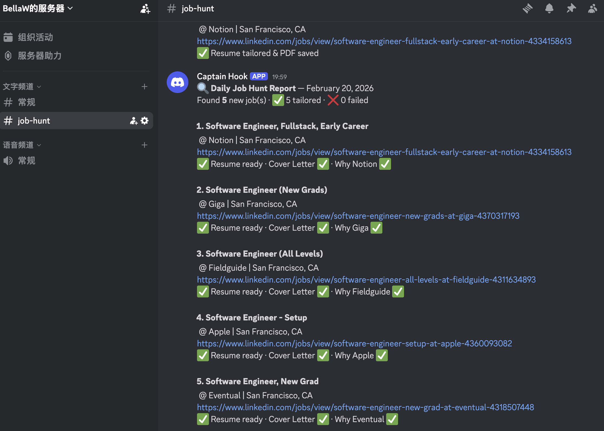

<div align="center">

# 🤖 LinkedIn Job-Hunt Workflow

**Stop tailoring resumes by hand. Let AI do it while you sleep.**

An end-to-end automated pipeline that scrapes LinkedIn, tailors your resume + cover letter to every job description with Claude AI, renders print-ready PDFs, and pings you on Discord — every morning on autopilot.

[](https://python.org)
[](https://playwright.dev)
[](https://anthropic.com)
[](LICENSE)
[](https://github.com/ziw224/linkedin-job-workflow/stargazers)
[](https://github.com/ziw224/linkedin-job-workflow)
[](https://github.com/ziw224/linkedin-job-workflow/tree/mcp)
[](https://github.com/ziw224/linkedin-job-workflow/tree/cli)



</div>

---

## 🌿 Branches

This repo ships three ways to use the workflow — pick what fits your setup:

| Branch | How you interact | Best for |
|---|---|---|
| **[main](https://github.com/ziw224/linkedin-job-workflow)** ⭐ | Talk to your AI assistant (OpenClaw/Discord) | Daily use — trigger by voice or chat |
| **[mcp](https://github.com/ziw224/linkedin-job-workflow/tree/mcp)** | Claude Desktop tool calls | Claude Desktop / Cursor power users |
| **[cli](https://github.com/ziw224/linkedin-job-workflow/tree/cli)** | `python src/cli.py run` from terminal | Cron jobs, scripts, server automation |

The core pipeline (scraping, tailoring, PDF, Discord) is identical across all branches.

---

## ✨ What makes this different

Most job-hunt tools stop at scraping. This one goes all the way:

| Feature | Details |
|---|---|
| 🔍 **Smart scraping** | Playwright scrapes LinkedIn public pages — no login, no API key |
| 🧠 **AI resume tailoring** | Claude rewrites bullets to match each JD — surgical edits, never fabricates |
| 💌 **Cover letter generation** | Personalized 3-paragraph letter grounded in your actual background |
| 🤔 **"Why this company?"** | 3-5 sentence answer tailored to the role's real responsibilities |
| ⚡ **Parallel pipeline** | Resume + cover letter generated concurrently; multiple jobs run in parallel |
| 📄 **PDF rendering** | Playwright renders pixel-perfect, single-page PDFs from HTML |
| 🔔 **Discord notifications** | Daily report with every job, status, and direct links |
| 🔁 **Fallback stages** | Automatically widens filters if primary search yields too few jobs |
| 🧹 **Smart dedup** | `seen_jobs.json` ensures you never process the same job twice |

---

## ⚡ Performance — Parallelism at every layer

This pipeline is designed to be fast. Two levels of concurrency:

```
Phase 1 — Serial (~2 min)
  └── Playwright scrapes all job cards + fetches full JDs

Phase 2 — Parallel (~8 min for 10 jobs)
  ├── Job 1 ──┬── Claude: Tailor resume   ┐ concurrent
  │           └── Claude: Cover letter    ┘
  │                └── Playwright: HTML → PDF
  ├── Job 2 ──┬── Claude: Tailor resume   ┐ concurrent
  │           └── Claude: Cover letter    ┘
  │                └── Playwright: HTML → PDF
  └── ... (configurable worker count)

Phase 3 — Serial (~5 sec)
  └── Discord webhook report
```

**Result:** 10 fully tailored applications (resume + cover letter + why-company + PDF) in under **12 minutes**, hands-free.

---

## 🏗️ Tech Stack

| Layer | Technology |
|---|---|
| **Web Scraping** | Playwright (headless Chromium) — no login required |
| **AI / LLM** | Claude Code CLI (claude-sonnet, Claude Max subscription) |
| **Concurrency** | `concurrent.futures.ThreadPoolExecutor` — 2-level parallelism |
| **PDF Rendering** | Playwright print API with CSS auto-scaling to 1 page |
| **Config** | JSON-driven search config, zero code changes to customize |
| **Notifications** | Discord webhook |
| **Scheduling** | Unix cron |
| **Language** | Python 3.11+ |

---

## 🔄 How it works

```
┌─────────────────────────────────────────────────────────────┐
│                   Daily Cron (7:30 AM)                       │
└──────────────────────┬──────────────────────────────────────┘
                       │
              ┌────────▼────────┐
              │  LinkedIn Scrape │  Playwright scrapes public
              │  (no login)      │  search pages → fetches JDs
              └────────┬─────────┘
                       │  new jobs (deduped against seen_jobs.json)
          ┌────────────▼────────────────┐
          │   ThreadPoolExecutor        │  N workers in parallel
          │  ┌──────────────────────┐   │
          │  │  For each job:       │   │
          │  │  ┌────────────────┐  │   │
          │  │  │ Tailor Resume  │──┼───┼── Claude CLI (subprocess)
          │  │  └────────────────┘  │   │   ATS keyword weaving,
          │  │  ┌────────────────┐  │   │   bullet reordering,
          │  │  │ Cover Letter   │──┼───┼── data-lock protection
          │  │  └────────────────┘  │   │
          │  │  (above 2 run in     │   │
          │  │   parallel per job)  │   │
          │  │  ┌────────────────┐  │   │
          │  │  │  HTML → PDF    │──┼───┼── Playwright print API
          │  │  └────────────────┘  │   │   CSS auto-scale to 1pg
          │  └──────────────────────┘   │
          └────────────┬────────────────┘
                       │
              ┌────────▼─────────┐
              │  Discord Report   │  Summary with links + status
              └──────────────────┘
```

**Output per job** → `resume/output/YYYY-MM-DD/{Company}/`
```
├── {id}_{Company}.html               ← tailored resume
├── {Name}-Resume-{Company}.pdf       ← print-ready PDF
├── {Name}-CoverLetter-{Company}.txt  ← cover letter
└── {Name}-Why{Company}.txt           ← "why this company?" answer
```

---

## 🗣️ Use as an AI Skill (main branch — recommended)

The `main` branch ships an **[OpenClaw](https://openclaw.ai) skill** so your AI assistant can trigger the workflow on demand from any chat — Discord, Telegram, Signal, iMessage, etc.

### What you can say

```
"抓一下今天的职位"       → scrape LinkedIn, post job list to Discord (~3 min)
"跑一下求职流水线"       → full run: tailor + PDF + Discord report (~12 min)
"今天跑了什么"           → check today's output status
```

### Setup

**1.** Copy the skill into your OpenClaw workspace:
```bash
cp -r skills/job-hunt ~/.openclaw/workspace-main/skills/
```

**2.** Restart OpenClaw:
```bash
openclaw gateway restart
```

**3.** That's it — talk to your assistant and it handles the rest.

> 📖 Full setup (Python, Claude CLI, config files): see [SETUP.md](SETUP.md)

---

## 🤖 MCP Server (mcp branch)

Want to call the workflow as tools from **Claude Desktop** or **Cursor**?
→ Switch to the [`mcp` branch](https://github.com/ziw224/linkedin-job-workflow/tree/mcp) — it adds `src/mcp_server.py` with 5 callable tools.

---

## 💻 CLI (cli branch)

Prefer running from the terminal or a cron job directly?
→ Switch to the [`cli` branch](https://github.com/ziw224/linkedin-job-workflow/tree/cli) — it focuses on `python src/cli.py run / scrape / status`.

---

## 🚀 Quick Start

> 📖 For the full step-by-step guide, see [SETUP.md](SETUP.md)

**Prerequisites:** Python 3.11+, [Claude Code CLI](https://docs.anthropic.com/en/docs/claude-code) with Max subscription, a Discord webhook

```bash
# 1. Clone & install
git clone https://github.com/ziw224/linkedin-job-workflow.git
cd linkedin-job-workflow
pip install -r requirements.txt
playwright install chromium

# 2. Configure
cp .env.example .env                                        # add Discord webhook
cp config/candidate_profile.example.json \
   config/candidate_profile.json                            # fill in your info
# Add your resume as resume/base_resume.html

# 3. Run
python src/main.py

# 4. Schedule (crontab -e)
# 30 7 * * * /path/to/job-workflow/run.sh
```

---

## ⚙️ Configuration

Everything is controlled through two JSON files — no code changes needed:

**`config/search_config.json`** — job search behavior
```json
{
  "locations": ["San Francisco, CA", "Remote"],
  "max_days_old": 14,
  "categories": {
    "sde": { "keywords": ["Software Engineer", ...], "target_count": 5 },
    "ai":  { "keywords": ["AI Engineer", "ML Engineer", ...], "target_count": 5 }
  },
  "fallback": { "stages": [...] }   // auto-retry with relaxed filters
}
```

**`config/candidate_profile.json`** *(gitignored — your personal info stays local)*
```json
{
  "name": "Your Name",
  "email": "you@example.com",
  "bio": "Your background, projects, experience — Claude uses this verbatim"
}
```

---

## 🔒 Privacy by design

- `config/candidate_profile.json` is **gitignored** — your personal info never leaves your machine
- `resume/base_resume.html` is **gitignored** — same for your resume
- `data/seen_jobs.json` is **gitignored** — machine-specific job history
- The repo contains **zero personal information** out of the box

---

## 📁 Project Structure

```
linkedin-job-workflow/
├── src/
│   ├── main.py               # Orchestrator — phases 1 / 2 / 3
│   ├── cli.py                # CLI wrapper (scrape / run / status)
│   ├── linkedin_scraper.py   # Playwright LinkedIn scraper (no login)
│   ├── resume_tailor.py      # Claude-powered resume tailoring
│   ├── cover_letter.py       # Cover letter + "Why Company" generation
│   ├── pdf_generator.py      # HTML → PDF via Playwright
│   ├── notifier.py           # Discord webhook reporter
│   └── run_one.py            # Quick single-job test
├── skills/
│   └── job-hunt/
│       └── SKILL.md          # OpenClaw skill (copy to ~/.openclaw/workspace-main/skills/)
├── config/
│   ├── search_config.json                # ✏️ Edit to change search behavior
│   ├── candidate_profile.example.json   # Template — copy to candidate_profile.json
│   └── settings.py                      # Reads config, exports constants
├── resume/
│   ├── base_resume.html      # 🔒 Your resume (gitignored)
│   └── output/               # 🔒 Generated files (gitignored)
├── data/seen_jobs.json       # 🔒 Dedup tracker (gitignored)
├── .env                      # 🔒 Secrets (gitignored)
├── .env.example
├── requirements.txt
├── run.sh                    # Cron entry point
└── SETUP.md                  # Full setup guide
```

---

## 🤝 Contributing

PRs welcome! Some ideas if you want to contribute:
- 🌐 Support for other job boards (Indeed, Greenhouse, Lever)
- 📊 Track application status over time
- 🎨 More resume template formats
- 🔍 Better JD parsing / skill extraction

---

<div align="center">

**If this saved you time, give it a ⭐ — it helps others find it!**

Made with ☕ and too many rejected applications

</div>
